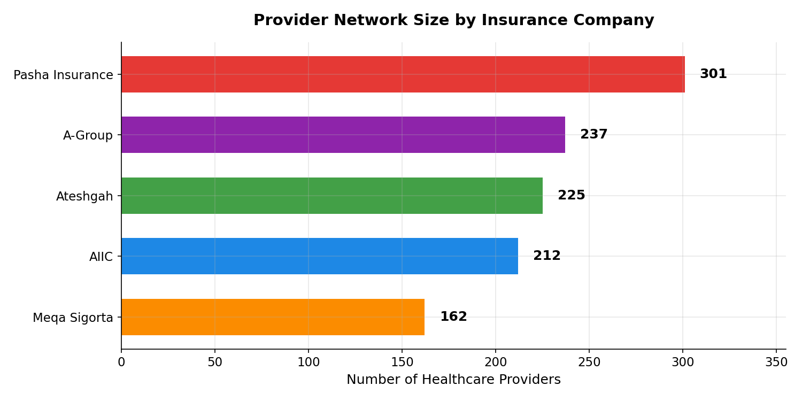
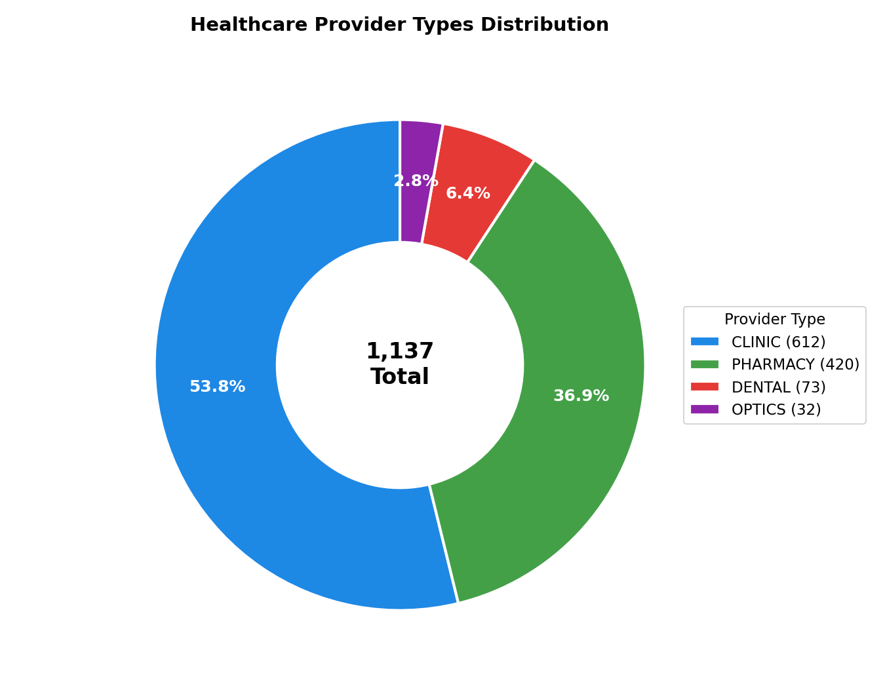
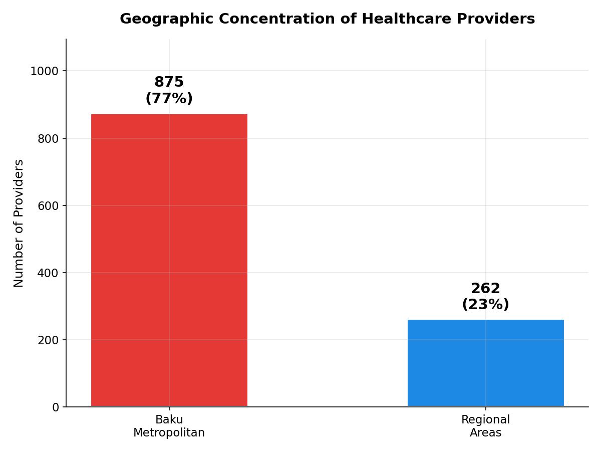
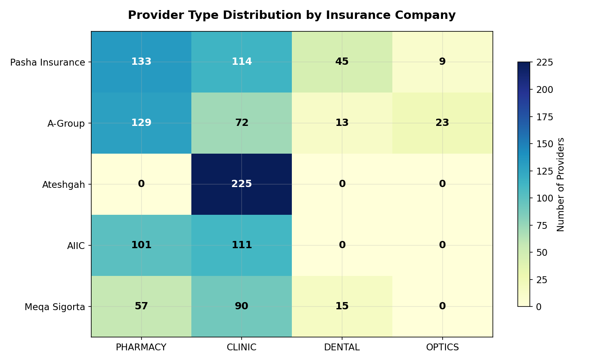
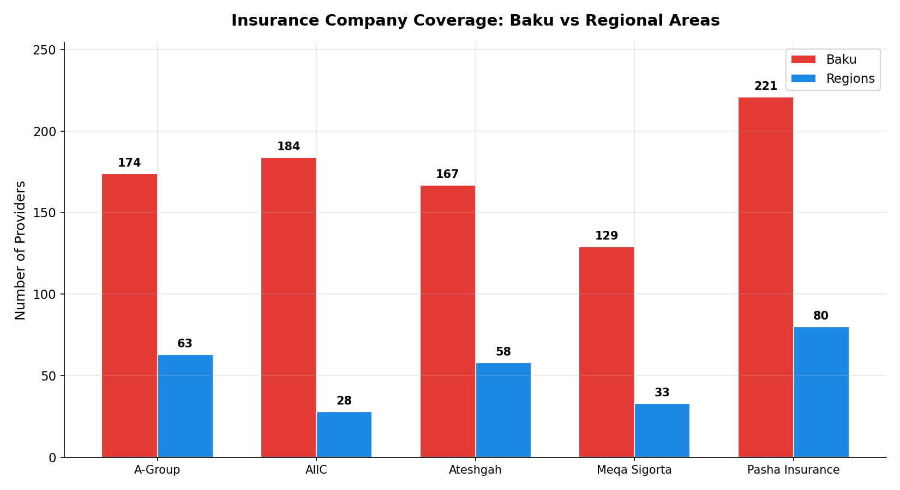
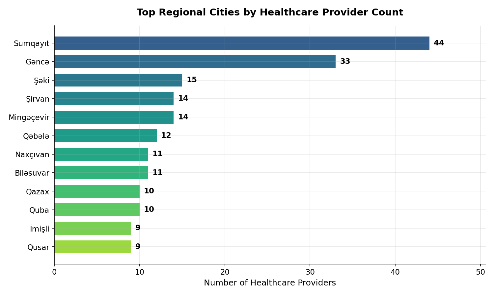
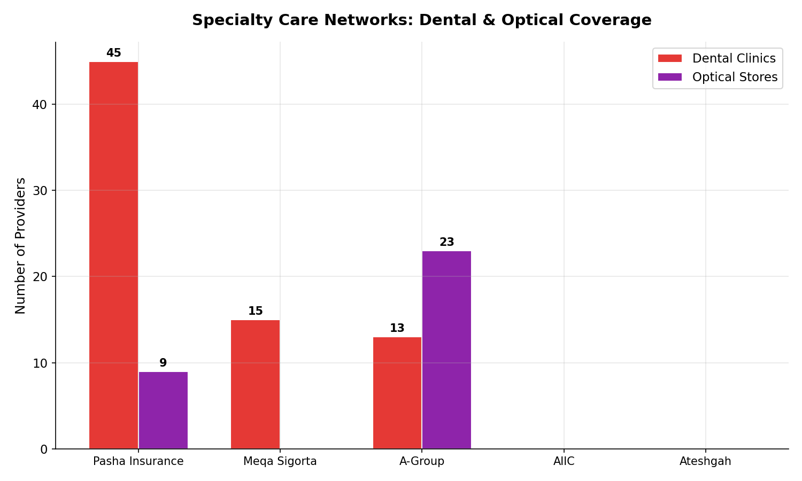
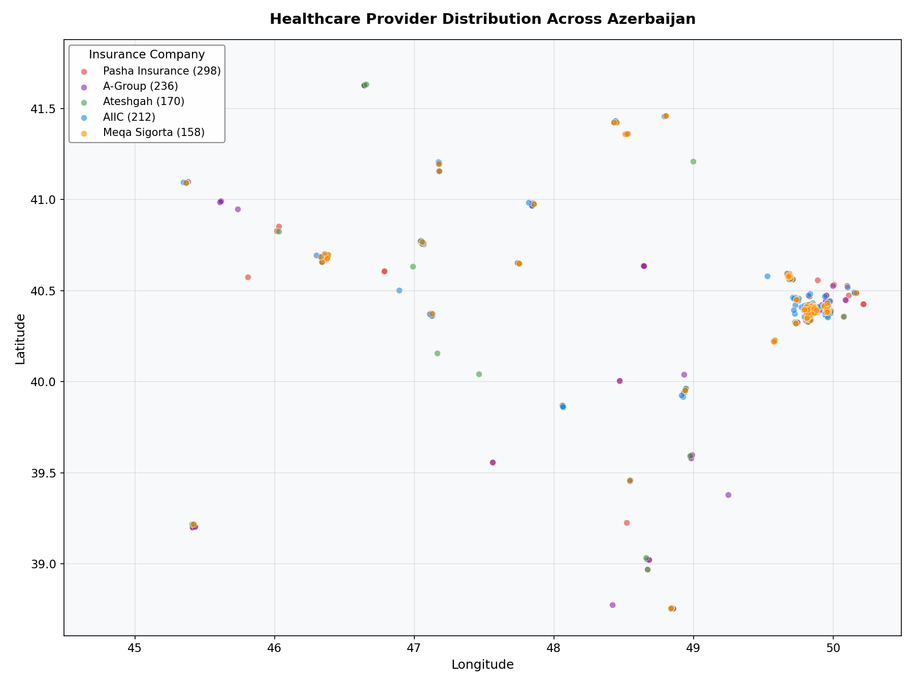

# Azerbaijan Health Insurance Provider Network Analysis

Analysis of healthcare provider networks across 5 major insurance companies in Azerbaijan.

## Key Findings

| Metric | Value |
|--------|-------|
| Total Providers | **1,137** |
| Insurance Companies | 5 |
| Baku Coverage | 77% |
| Regional Coverage | 23% |

---

## 1. Network Size Comparison

**Pasha Insurance** has the largest provider network (301), followed by A-Group (237) and Ateshgah (225). The bottom three combined still don't match Pasha's network size.



---

## 2. Provider Type Distribution

Clinics dominate (54%) followed by pharmacies (37%). Specialty services - dental (6%) and optical (3%) - are significantly underrepresented across all insurers.



---

## 3. Geographic Imbalance

**77% of all providers are in Baku**, leaving regional populations underserved. This concentration creates a significant coverage gap for the ~40% of Azerbaijan's population living outside the capital.



---

## 4. Company Strategy Differences

Each insurer has a distinct strategy:
- **Pasha Insurance**: Pharmacy-focused (179 pharmacies)
- **Ateshgah**: Clinic-only model (225 clinics, zero pharmacies)
- **Meqa Sigorta**: Dental specialist (45 dental clinics)
- **A-Group**: Most diversified portfolio



---

## 5. Regional Presence

**Meqa Sigorta operates almost exclusively in Baku** (96% urban). Pasha Insurance and A-Group show the strongest regional commitment with ~23% of their networks outside Baku.



---

## 6. Regional Cities Coverage

After Baku, **Sumqayit** (39 providers) and **Ganca** (26 providers) have the best coverage. Most other regions have fewer than 15 providers total.



---

## 7. Specialty Care Gap

**Dental and optical services are severely limited**:
- Only Meqa Sigorta (45) and Pasha Insurance (19) offer meaningful dental coverage
- A-Group dominates optical with 23 stores; most others have zero



---

## 8. Geographic Distribution

Provider density drops sharply outside the Baku-Sumqayit corridor. Western (Ganca) and southern (Lankaran) regions have scattered coverage.



---

## Project Structure

```
health_insurance_analyse/
├── data/
│   ├── combined.csv           # 1,137 merged records
│   ├── pasha_insurance.csv    # 314 records
│   ├── aiic.csv               # 212 records
│   ├── ateshgah.csv           # 225 records
│   ├── meqa_sigorta.csv       # 168 records
│   └── a_group.csv            # 247 records
├── scripts/
│   ├── combine.py             # Data merger
│   └── generate_charts.py     # Chart generator
├── notebooks/
│   └── analyse.ipynb          # Jupyter notebook
├── charts/                    # 8 analysis charts
└── README.md
```

## Usage

```bash
# Combine all data sources
python scripts/combine.py

# Generate charts
python scripts/generate_charts.py
```

## Data Fields

| Field | Description |
|-------|-------------|
| name | Provider name |
| type | PHARMACY, CLINIC, DENTAL, OPTICS |
| address | Full address |
| latitude/longitude | GPS coordinates |
| city | City/region |
| source | Insurance company |

---

*December 2025*
